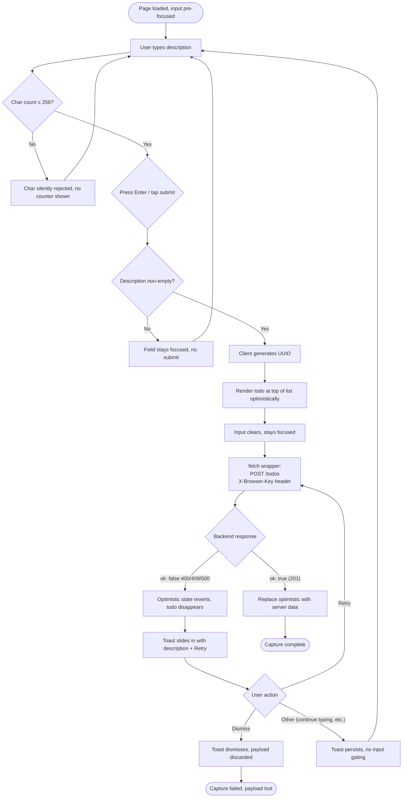
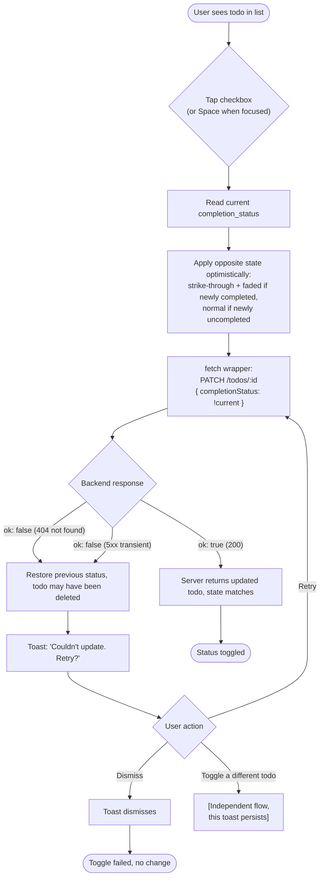
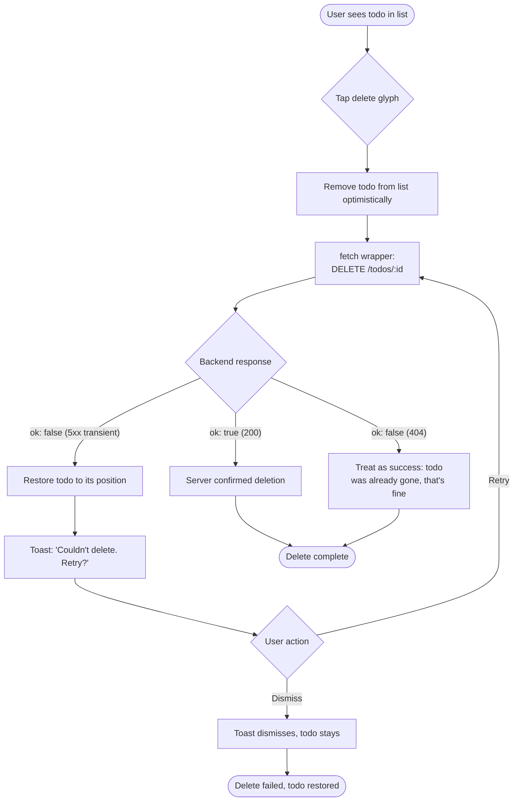
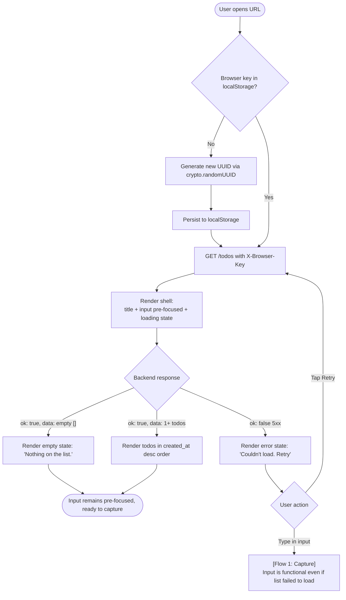

---
stepsCompleted:
  - step-01-init
  - step-02-discovery
  - step-03-core-experience
  - step-04-emotional-response
  - step-05-inspiration
  - step-06-design-system
  - step-07-defining-experience
  - step-08-visual-foundation
  - step-09-design-directions
  - step-10-user-journeys
  - step-11-component-strategy
  - step-12-ux-patterns
  - step-13-responsive-accessibility
  - step-14-complete
status: 'complete'
completedAt: '2026-04-29'
lastStep: 14
inputDocuments:
  - _bmad-output/planning-artifacts/prd.md
  - _bmad-output/planning-artifacts/architecture.md
  - _bmad-output/planning-artifacts/product-brief-ToDo-App.md
  - _bmad-output/planning-artifacts/product-brief-ToDo-App-distillate.md
  - docs/prd-source.md
documentCounts:
  prd: 1
  architecture: 1
  brief: 2
  projectDocs: 1
  projectContext: 0
workflowType: 'ux-design'
project_name: 'ToDo App'
user_name: 'Pouya'
date: '2026-04-29'
---

# UX Design Specification — ToDo App

**Author:** Pouya
**Date:** 2026-04-29

---

<!-- UX design content will be appended sequentially through collaborative workflow steps -->

## Executive Summary

### Project Vision

ToDo App is a single-screen, full-stack personal todo app that does exactly one thing well: capture, complete, and clear personal tasks with zero friction. From a UX perspective, the vision is **calm-by-default expressed through visible refusal of modern productivity-app conventions** — no streaks, no overdue badges, no completion-percentage anxiety, no celebratory animations. The visual language reinforces this stance through a **vintage-inspired Macintosh System 7 aesthetic** (monochrome + one accent, vintage-flavored modern type), turning *refusal of synthetic urgency* into a positive design statement rather than just an absence.

The product is also the canonical worked-example reference for the AINE BMAD training pathway. UX decisions must be **trainee-derivable** — every design choice leaves a documented rationale, and the visual personality is consistent enough that a trainee inspecting the artifact set sees the design discipline as load-bearing, not decorative.

### Target Users

**Primary — Sam, the focused individual.** Already drawn in the PRD's user-journeys section. Sam works hybrid, juggles a few small projects, keeps a short personal list. Currently rotates between Apple Reminders, sticky notes, and the back of an envelope. Has tried Todoist twice and abandoned it both times — *"the app wanted me to organize my life; I just wanted to remember three things."* Wants a list that opens fast, takes the thought, and disappears.

UX implications:
- **Fluency, not learning.** Sam should never have to figure the app out. No onboarding, no welcome modal, no tour. Input field pre-focused on load.
- **Minimal interaction surface.** Four verbs, four states, one screen. Every additional interaction is friction.
- **Calm signals over urgent signals.** Sam values the absence of pressure. Status communicated through *quiet* cues (strike-through, reduced opacity) — never red, never escalating in size, never animated to grab attention.
- **Same-browser durability is the implicit contract.** Sam expects to open the URL tomorrow and find their list. Cross-device "everything just syncs" is *not* part of Sam's mental model in v1; the deployment posture (private URL, per-browser-per-deployment) makes that explicit.

**Secondary — Jordan, the trainee.** Consumes the artifact set to reproduce v1 within one focused workday. The UX spec is one of those artifacts.

UX implications for Jordan:
- The UX spec needs to be **readable as a teaching artifact**, not just an implementation brief. Token names, component contracts, and state-machine descriptions should be self-explanatory.
- "Decisions Not Made" extends to UX: every refused pattern (e.g., color-coded priority tags, swipe-to-archive, drag-to-reorder) gets a one-line rationale.

### Key Design Challenges

1. **Calm-by-default-visible.** *Calm* is famously hard to design *for* — most calm interfaces look like they didn't try. The vintage System 7 direction lets calm become *visible* through a positive aesthetic statement (deliberate retro choice) rather than the absence of contemporary patterns. The challenge: keep the vintage flavor restrained enough that it reads as *quiet personality*, not *retro costume*.
2. **Optimistic-UI rollback as a visible pattern.** The architecture's optimistic-UI-with-explicit-rollback is one of the most subtle UX behaviors in v1 — the user's mental model has to handle "I just did X" → "wait, X disappeared" → toast → "ah, retry." The UX spec must define toast behavior precisely (where it appears, motion, dismissal, retry affordance, live-region politeness) so the rollback never reads as a bug.
3. **Designed empty/loading/error/long-list states.** The PRD names these as four mandatory states. The UX spec must treat them as *first-class screens* with explicit visual designs, not afterthoughts. The empty state in particular has a tension: Sam shouldn't see a "nudge to capture" pitch (calm-by-default), but pure void can read as broken. Vintage Mac empty windows handled this elegantly with subtle dithered patterns or quiet typographic placeholders — we'll lean on that vocabulary.
4. **WCAG AA on a vintage palette.** Some authentic period-appropriate hex values (CRT amber on black, dithered grays as text) won't clear 4.5:1 contrast for body text. Every palette value needs to be *tuned to clear AA*, accepting that we're not 1:1 with the originals. This is non-negotiable per Project Principles.
5. **Touch-target floor on a desktop-influenced aesthetic.** System 7 was a mouse-and-keyboard era; touch UX with ≥44 × 44 CSS pixel targets requires expanded hit areas that aren't visible in the original aesthetic. Vintage flavor on visual elements; modern dimensions on touch surfaces.

### Design Opportunities

1. **The vintage aesthetic earns its keep at the FR level.** Strike-through-on-completed (FR12) reads as a *direct visual quote* of System 7 list rendering — checked-off items literally shown with a typographic strike. The aesthetic isn't just decoration; it's the literal mechanism of the status signal.
2. **Toast as a system-message dialog descendant.** System 7's modal alerts had a strong visual personality (dithered shadow, beveled chrome, Chicago typography, one bold action). The non-blocking toast — refusing modal interruption while still feeling *appropriately retro* — is a clean inheritance: same chrome vocabulary, smaller, no modal scrim, slides in instead of taking over.
3. **The empty state as a personality moment.** A blank vintage-Mac window with a quiet, characterful empty-state message ("nothing on the list") delivers personality without inserting urgency. This is the one place where the aesthetic gets to wave at the user.
4. **Accessibility-as-personality.** Visible focus indicators are required by WCAG AA. The System 7 aesthetic *already* has a strong "selected/focused" visual vocabulary (inverted color block on selection). Embracing this gives us a focus indicator that's *more* visible than the modern norm — accessibility upgrade as a *feature*, not a compromise.
5. **The sound of typing.** (Optional, future.) Old-Mac typing-sound feedback would be a strong personality moment, but it's a calm-by-default tension — sound at all is loud. v1 ships silent; flag this as a "decisions not made yet" candidate for a later module.

## Core User Experience

### Defining Experience

**The core action is *capture*.** Everything else (see, complete, delete) flows from the moment "I have something to remember." If add is friction-free, the rest of the verbs are inevitable; if add has any friction at all, users abandon the app for the back of an envelope.

The defining experience is therefore: **a focused user thinks of something → opens the app → types it → presses Enter → moves on.** Total elapsed time should feel like writing on paper. Anything that interposes between *thought* and *captured* (login, project picker, priority dropdown, due-date picker, label selector) is a refused feature, not a missing one.

### Platform Strategy

- **Primary platform:** responsive web application, served as a single-page React application via React Router 7 (per architecture).
- **Form factors:** desktop (≥1025 px), tablet (641–1024 px), mobile (≤640 px). One layout, three breakpoints, same routes and same bundle.
- **Input modalities:** mouse + keyboard (primary on desktop), touch (primary on mobile). Both must be first-class — every verb completable by either.
- **Offline:** explicit non-goal. Network-required by design; failures surface through the optimistic-rollback path.
- **No native APIs:** no Notifications API, no Push, no install-prompt UI, no clipboard "share", no Service Worker. v1 is a web page, full stop.
- **Browser baseline:** last-2-majors of Chrome / Edge / Firefox / Safari (desktop + mobile). Browsers without `localStorage` and `fetch` are unsupported.

### Effortless Interactions

These should require **zero thought** from Sam:

- **Input pre-focused on load.** Page renders → cursor is in the input field. Sam types immediately, no click required.
- **Enter to submit.** Single keystroke commits. No "save" button. No "submit" button.
- **Instant visual feedback.** Optimistic UI — the new todo appears at the top of the list before the network round-trip completes (<100 ms p95 perceived). Sam never waits.
- **Single-tap toggle complete.** Checkbox or character-tap; no confirmation, no "are you sure", no dropdown to "mark as done."
- **Single-tap delete.** No confirmation prompt. (Recovery is the rollback-with-retry-toast on backend rejection only — per FR7.)
- **Auto-clear input on submit.** After Enter, the field empties and remains focused. Capture-another is the same gesture as capture-first.
- **Same browser, same list, always.** Sam doesn't sign in. Doesn't pick an account. Doesn't choose a workspace. The list is just *there*, identified by the opaque browser key the deployment issued on first interaction.

### Critical Success Moments

The interactions that define success or failure for v1:

1. **First-load → first-capture, unaided.** Sam opens the URL for the first time. They see an empty list (designed empty state). They type a thing. They press Enter. The thing appears. **If this fails, the product fails.** Validation: ≥4/5 in the 5-person usability test complete this unaided.
2. **Optimistic add with zero perceived latency.** The 100 ms p95 budget is the felt difference between "magic" and "loading spinner". Cross that threshold and Sam stops trusting the app.
3. **Optimistic-rollback with non-blocking toast.** When the backend rejects, the user sees the change disappear *and* a clear toast with Retry. **If this reads as a bug, the product fails.** The toast must be visible enough to be noticed, calm enough not to interrupt, and persistent enough that Sam can act on it. (Detail in toast spec.)
4. **Strike-through on completion.** A single tap → instant visual transition to struck-through, faded. The vintage Mac aesthetic earns its keep here: the strike-through *is* the status, not a color cue layered on top. Color-blind safe by construction.
5. **Returning to the list tomorrow.** Sam opens the URL the next day. The list is *exactly* as they left it — same items, same order, completed items still visible until deleted. If the persistence model surprises Sam, the calm-by-default contract breaks.

### Experience Principles

These guide every UX decision downstream:

1. **The list is the verb.** No homepage, no dashboard, no overview. Open the app → see the list. Capture and view are one motion.
2. **Refusal of urgency is a feature.** Every excluded pattern (streaks, badges, percentages, color-coded urgency, due-date pickers, recurring rules) is a deliberate documented decision, not an oversight. The visual language reinforces refusal as *positive design statement*.
3. **Trust the user; verify quietly.** Optimistic UI is the contract. The client believes Sam first; the server confirms second; rejection is visible-but-non-blocking.
4. **Vintage flavor over vintage costume.** System 7 aesthetic is the *quiet personality* of the product, not a retrocomputing LARP. Modern proportional type, modern dimensions, modern accessibility — vintage palette, vintage chrome treatments, vintage attention to typographic detail.
5. **Accessibility-as-personality.** WCAG 2.1 AA is a non-negotiable floor. The visible focus indicator, the live-region toast, the keyboard-completable verb set — these are not compromises against the aesthetic; they *are* the aesthetic, executed well.
6. **One screen, no surprises.** No modals, no tooltips that explain things, no overlays. If something can't be expressed in the one screen with the existing primitives, it doesn't ship in v1.
7. **Decisions Not Made (UX edition).** Every refused interaction pattern lives in the artifact alongside the refused features. The UX spec extends the existing artifact, not creating a new one.

## Desired Emotional Response

### Primary Emotional Goals

**Calm.** Sam should close the app feeling like they put something down, not like they picked something up. The product is a tool, not a destination — opening it should feel like reaching for a pen, not opening a notification stream. The single-syllable test: when Sam describes the app to a friend, the most likely word is *"calm"* or *"quiet"* or *"clean"* — not *"powerful"*, *"smart"*, *"productive"*, or *"motivating"*.

**Lightness.** No accumulating obligations. Completed items don't pile up urgent reminders. Old uncompleted items don't escalate. The list never tells Sam they're behind.

**Trust.** Sam puts a thing in the list. Tomorrow it's there. They tap it as done. It stays done. The system never silently loses data; never invents notifications; never re-prioritizes Sam's list for them.

**Quiet personality.** The vintage-Mac aesthetic gives the app a *character* without giving it a *voice*. Sam should feel like they're using a deliberately-crafted thing — not a generic todo app, not an aggressively-branded one either.

### Emotional Journey Mapping

| Stage | Desired feeling | Key trigger |
|---|---|---|
| **First open** | Relief | No login screen, no welcome modal, no "let's set up your account" — just the empty list and a focused input |
| **First capture** | Fluency | Type → Enter → it's there. The 100 ms p95 budget is the felt difference between "magic" and "loading" |
| **Adding more** | Quiet rhythm | Field auto-clears, stays focused. Adding a 2nd, 3rd, 4th item is the same gesture as the 1st |
| **Tapping complete** | Quiet satisfaction | Strike-through and fade. Not a celebration. Not a sound. Sam saw the change happen; no further confirmation needed |
| **Returning tomorrow** | Trust | The list is exactly as left. Same items, same order, completed items still visible until deleted. The persistence model held |
| **On rollback (network failure)** | Reassurance, not panic | The optimistic update reverts. A toast says *"Couldn't save. Retry?"* Sam clicks Retry; their text wasn't lost; the system recovers |
| **Closing the app** | Done-with-it | No notifications will fire. No badge will appear on a phone. Sam doesn't think about the app until they need it again |

### Micro-Emotions

The micro-emotional spectrum, with v1's stance on each:

| Pair | v1 favors | How |
|---|---|---|
| **Confidence vs. confusion** | Confidence | Pre-focused input, single-action submission, instant optimistic feedback. No menus to navigate, no dropdowns to puzzle over. |
| **Trust vs. skepticism** | Trust | Visible-but-non-blocking error recovery; persistence holds across refresh/restart; no silent failures. |
| **Excitement vs. anxiety** | Neither — **calm** | Refusal of synthetic urgency. No streaks, no overdue badges, no completion percentages. The app aims for *neutral affect*, not stimulation. |
| **Accomplishment vs. frustration** | Quiet accomplishment | Strike-through is the celebration. No animation, no sound, no point counter. Sam sees they did it; the app doesn't perform on their behalf. |
| **Delight vs. satisfaction** | Satisfaction | "Delight" in the modern UX sense often shades into *interruption disguised as charm* (Easter eggs, surprise animations). v1 goes for *competent quiet* over *delightful surprise*. |
| **Belonging vs. isolation** | N/A — single-user product | No social layer, no shared lists, no collaborative cursors. The user is alone with their list, on purpose. |

### Emotions to Avoid

These are the negative-affect patterns the modern productivity-app category routinely creates and v1 explicitly refuses:

- **Anxiety from "you're behind."** No overdue indicators, no escalating colors, no "X tasks pending today" headers.
- **Guilt from "you broke your streak."** No streak counter exists.
- **FOMO from "you missed something."** No notifications, no badges, no email digests.
- **Decision fatigue from "where does this go?"** No projects, no labels, no priorities, no due dates. One list, four verbs.
- **Performance pressure from "you only completed 60%."** No completion percentage display.
- **Surprise from "we changed it."** No A/B tests on the user-facing UI; no auto-categorization.
- **Loneliness from "you're using this wrong."** No empty-state nudge to capture more, no productivity coaching, no "did you know you can…" tooltips.

### Design Implications

Connecting each emotional goal to concrete UX decisions:

| Emotional goal | Design decision |
|---|---|
| Calm | Vintage System 7 palette (monochrome + one accent); zero animation that wasn't strictly required; no sound; quiet typography; no decorative elements without functional purpose |
| Lightness | Completed items remain (no urgent "clean up" feeling) but are visually receded; no badges, no counters, no overdue cues; no "X tasks pending" headers |
| Trust | Optimistic UI with explicit rollback; toast surface that's noticed but doesn't gate input; persistence durability messaged through *consistent return-experience*, not through reassurance copy |
| Quiet personality | Vintage-flavor (not costume); a single empty-state moment where personality surfaces; consistent vintage chrome treatment (button styling, toast frame, focus indicator) |
| Confidence | Input pre-focused; no save button; immediate optimistic feedback; no confirmation prompts on destructive actions (delete is instant) |
| Reassurance on error | Toast surface uses calm copy ("Couldn't save 'X'. Retry?") not alarm copy ("ERROR! FAILED!"); rollback animation is the same gentle fade as completion-toggle |

### Emotional Design Principles

Five guiding rules for every UX decision downstream:

1. **The interface is a quiet room.** Default to silence. Justify any animation, sound, or attention-grab against this default; if it can't justify, it doesn't ship.
2. **Status, not score.** Visual state communicates what *is* (active, completed, pending) — never *how much* or *how well* (no percentages, no scores, no "good job" ratings).
3. **Recovery before reassurance.** When something goes wrong, show the user *what they can do* (Retry button) before *that everything's fine*. Calm copy, not alarm copy, not pacifying copy.
4. **Personality lives in the chrome, not the messages.** The vintage aesthetic carries the product's character through its frames, fonts, focus indicators, and cursor — not through chatty empty-state copy or anthropomorphized animations.
5. **Refusal is the brand.** Every refused pattern (streaks, overdue badges, completion percentages, modal interruptions, notifications, sound) is a positive design statement. The user feels the *absence* of pressure as a deliberate gift.

## UX Pattern Analysis & Inspiration

### Inspiring Products Analysis

**Vintage UI references (direct visual anchor):**

| Product | What it does well | Lesson for ToDo App |
|---|---|---|
| **Macintosh System 1–7** (1984–1996) | Disciplined monochrome + dithered grays; Chicago/Charcoal typography; Susan Kare iconography; modal dialogs with strong personality; "selection" as a visible inverted block | The aesthetic vocabulary. Strike-through-as-status, beveled chrome on buttons, focus-as-inverted-block, characterful typography even in 1-bit constraints. |
| **HyperCard** (1987) | Quiet, uncluttered monochrome canvas; no chrome competing with content; each card a self-contained moment | The "empty canvas" stance: an empty list isn't broken, it's *the canvas*. The aesthetic gives empty space room to breathe. |
| **NeXTSTEP / NeXTMail** (1989) | Restrained monochrome with proportional Display PostScript typography; fine attention to typographic rhythm; clean information hierarchy | Vintage-without-pixel-perfect. Proves that "old computer" can read as *quietly competent* without being a costume. |
| **System 7 Note Pad** (1991) | Single-window, single-purpose, no organizational overhead; opens to where you left off; closes invisibly | Closest spiritual ancestor to v1. *The thing is the thing* — no folder hierarchy, no metadata, no formatting. The Note Pad is exactly what Sam wants for tasks. |

**Contemporary calm-minimalist references (interaction philosophy):**

| Product | What it does well | Lesson for ToDo App |
|---|---|---|
| **iA Writer** | Pre-focused cursor is the entire UI; chrome hides until needed; typography does all the work; no formatting toolbar | "The cursor is the UI." We already do this with the pre-focused input field. iA Writer also proves *typographic restraint creates focus* — we'll borrow the discipline of letting type do the work. |
| **Bear** (notes app) | Vintage-flavored typography pairings; quiet, restrained chrome; tag-based organization that's invisible until invoked | Validation that *vintage flavor + modern interaction* works for a productivity tool. Bear's typography pairings (Avenir-style proportional + a code-monospace) are a useful template. |
| **Apple Reminders** (incumbent for Sam) | Single-tap toggle complete; instant capture; iOS-native fluency | The mechanics we're matching. Where it falls short: badge count on app icon (anxiety vector), suggested completions (interruption), default category prompts (decision fatigue). v1 does the same mechanics *without* the surrounding noise. |
| **Paper notebook + pen** | Zero animation; zero notifications; perfect persistence; capture latency is purely physical | The actual benchmark. Anything v1 does that paper *doesn't* do should justify itself against this baseline. (We allow ourselves: search would be valuable but isn't in v1; strike-through is cheap to do digitally; deletion without an eraser smudge is a minor upgrade.) |

### Transferable UX Patterns

**Adopt directly:**

- **Pre-focused input as the entire UI.** From iA Writer / System 7 Note Pad. The page loads → cursor is in the input → Sam types. Already in our spec; this validates the choice.
- **Strike-through as the *visible status*.** From System 7 list rendering. The strike *is* the completion state, not a layered color cue. Already in spec.
- **Inverted-block selection / focus indicator.** From System 7. Apply this for the keyboard focus ring on todo items and form controls — it's *more* visible than the modern outline ring, satisfying AA visibly.
- **Single-purpose modal-as-dialog descended into a non-blocking toast.** From System 7's alert panels. The toast frame inherits the visual chrome (1-px border, dithered shadow, Chicago-ish bold heading, single primary action) but doesn't take over the screen.
- **Typographic restraint creates focus.** From iA Writer / Bear. Pick *one* proportional family + *one* monospace family; use weight and size to create hierarchy, not color.
- **No empty-state nudge.** From paper notebooks. An empty list says "nothing on the list" or shows nothing at all — not "Get started by adding a task!"

**Adapt:**

- **System 7 modal alerts → non-blocking toast.** Same chrome vocabulary, smaller, no scrim, slides in. Adapt the visual personality without inheriting the modal interruption.
- **Bear's typography pairings → vintage-flavored proportional + Berkeley/IBM Plex Mono.** Modern revival of Charcoal-era proportional + a quiet monospace for any code-shaped contexts (timestamps, IDs in dev tools).
- **Apple Reminders single-tap toggle → tap-target-floor-aware checkbox.** Same gesture, but the touchable hit area is ≥44×44 CSS pixels even when the visible glyph is smaller (vintage chrome on a modern hit area).

### Anti-Patterns to Avoid

Specific patterns from competitors and the broader productivity-app category that v1 explicitly refuses, with rationale (extends the Decisions Not Made artifact):

| Anti-pattern | Source | Why we refuse |
|---|---|---|
| **"Karma" / point systems** | Todoist | Gamifies productivity; rewards quantity over judgment. Direct conflict with calm-by-default. |
| **Streak counters** | Habitica, Duolingo, TickTick | Shame-based engagement loop. "You broke your 47-day streak" is the antithesis of calm. |
| **"My Day" / today-list nudges** | Microsoft To Do | Inserts a daily decision fatigue moment; demands prioritization at app open. v1 has *one list*, no curated subsets. |
| **Daily summary email / push** | Most modern todo apps | Notifications are FOMO machinery. v1 ships zero notifications; future modules don't relax this. |
| **Auto-categorization / AI suggestions** | Notion, modern Reminders | Surprise (the system re-categorized your input); requires a mental model of what the AI *would* do. |
| **Modal "Are you sure?" on delete** | Most enterprise apps | Adds friction to a recoverable operation (rollback path on failure); pacifies the user instead of trusting them. v1 makes delete instant. |
| **Achievement-unlocked toasts / celebratory animations** | Habit-tracker apps generally | Rewards completion as performance; creates a cycle of seeking-the-reward over caring-about-the-task. |
| **Empty-state "Get started by..." pitch** | SaaS onboarding standard | The empty state is fine. Sam isn't a customer to be converted; they're a user with a list. |
| **Onboarding tour / tooltips / "did you know..."** | Most modern productivity apps | Sam should learn by using. Four verbs don't need a tour. |
| **Color-coded priority (red/yellow/green)** | Asana, Trello, etc. | Re-introduces synthetic urgency through color. v1 has no priorities at all; even if it did, color would be the wrong vocabulary. |
| **Pull-to-refresh on a screen with no real "fetch"** | Mobile apps generally | Performative interaction. v1 reads on load and uses optimistic UI for mutations; no pull-to-refresh affordance needed. |
| **Long-press menus with bulk actions** | Most modern list UIs | v1 has no bulk operations. One item at a time, by design. |

### Design Inspiration Strategy

**What to adopt** (use these patterns as written):
- iA Writer's pre-focused-cursor-is-the-UI.
- System 7's strike-through-as-status.
- System 7's inverted-block focus indicator.
- HyperCard's quiet empty canvas.
- Bear's vintage-flavored typography pairings.
- Paper notebook's zero-animation default.

**What to adapt** (modify for our context):
- System 7 modal alerts → non-blocking toast (same chrome, no scrim, slides in).
- System 7's beveled buttons → subtle 1-px borders + restrained beveling on focus state (modern-readable while vintage-flavored).
- Apple Reminders' single-tap toggle → 44 × 44 hit-area-floor with smaller visible glyph (vintage flavor, modern dimensions).
- Susan Kare iconography → either omit icons entirely (text-first) or use a *single* checkbox/delete icon family inspired by Kare's 16 × 16 pixel grid, anti-aliased for retina rendering.

**What to avoid** (every entry in the anti-pattern table above):
- Karma, streaks, "My Day," badges, notifications, AI suggestions, "are you sure?" modals, achievement toasts, empty-state pitches, onboarding tours, color-coded priority, pull-to-refresh, long-press bulk actions.

**The Strategy in one sentence:** Borrow the vintage-Mac visual vocabulary for *flavor and personality*, borrow contemporary minimalist apps' typographic and interaction discipline for *modern fluency*, and refuse every pattern from the modern productivity-app category that re-introduces urgency, gamification, or interruption.

## Design System Foundation

### Design System Choice

**Custom token-driven mini-system.** Built on the architecture's vanilla CSS + CSS Modules choice. No external UI library. The "system" is a small, named set of CSS custom properties (tokens), a few primitive components, and the conventions for how they compose.

**Scale appropriate to v1:**
- ~25 tokens total (color: ~8, spacing: ~5, typography: ~6, motion: ~3, border/elevation: ~3).
- ~5 primitive components (`Button`, `TextInput`, `Checkbox`, `ListItem`, `Toast`).
- ~3 layout containers (`AppShell`, `Stack`, `Inline`).
- All documented inline within `app/styles/tokens.css` and the component CSS Module files. The UX spec itself is the canonical reference; `CONVENTIONS.md` points to both.

### Why Established / Themeable Systems Don't Fit

| Option | Verdict | Reason |
|---|---|---|
| **Material Design (MUI)** | Reject | Visually inseparable from Material's identity; vintage-Mac aesthetic conflicts at the component level (rounded corners, ripple animations, FAB patterns); adds a heavyweight dependency the architecture avoids. |
| **Ant Design** | Reject | Same reasons as Material; B2B-enterprise visual identity is the wrong personality. |
| **Chakra UI** | Reject | Themeable, but the theming surface assumes modern flat design; would require fighting library defaults. |
| **Tailwind UI** | Reject | Tailwind itself was rejected at architecture stage. |
| **shadcn/ui** | Reject | Beautifully done but Tailwind-based. |
| **HTML defaults + custom CSS** | Considered | Cheapest possible system; but we still need *some* token discipline, and naming our own primitives makes the seam between raw CSS and components visible to trainees. |
| **Custom token-driven mini-system** | **CHOSEN** | Best fit. ~25 tokens, ~5 primitives, no external dep. Trainee reads the system end-to-end in an afternoon. |

### Rationale for Selection

1. **Aesthetic fit.** No existing design system ships a vintage-Macintosh-System-7 look. Adopting any third-party system means *fighting it* — overriding defaults, undoing rounded corners, replacing animations. A custom mini-system is *less* work than an opinionated library would be at this scope, because the surface is so small.
2. **Architectural fit.** The architecture explicitly rejected Tailwind, MUI, Chakra, and styled-components. The mini-system slots cleanly into the chosen stack: tokens.css + per-component `*.module.css` + per-component `*.tsx`.
3. **Trainee fit.** A trainee can read every token, every primitive, every CSS rule end-to-end in an afternoon. There's no library documentation to learn, no theming API to internalize, no "magic." The design system *is* the code that's in the repo. This is exactly what *trainee clarity wins* (the Project Principles tiebreaker) was written for.
4. **AA fit.** Owning every hex value and contrast ratio means we never inherit an a11y bug from a library's default theme. Every color token gets verified against the WCAG 4.5:1 floor at definition time.
5. **Calm-by-default fit.** Most modern UI libraries ship "engagement" defaults — animations on every state change, tooltip libraries with hover delays, toast libraries with auto-progress bars. The mini-system ships *only* what we need; refusal-by-default is the natural posture.

### Implementation Approach

**Token definition (`app/styles/tokens.css`):**

```css
:root {
  /* Color — monochrome + one accent. All values AA-tuned. */
  --color-bg: #FAFAF7;            /* ivory off-white, warmer than #FFF */
  --color-fg: #1A1A1A;            /* near-black; 16.1:1 on bg */
  --color-fg-muted: #555555;      /* secondary text; 7.5:1 on bg */
  --color-fg-faded: #888888;      /* completed text; 4.6:1 on bg (AA floor) */
  --color-border: #1A1A1A;        /* hard 1-px borders, like System 7 */
  --color-border-soft: #C8C8C8;   /* dithered-gray substitute */
  --color-accent: #0050D0;        /* Mac highlight blue, AA-tuned (4.7:1 on bg) */
  --color-accent-fg: #FAFAF7;     /* text on accent fields (inverted block) */

  /* Spacing — 8-px grid */
  --space-xs: 4px;
  --space-sm: 8px;
  --space-md: 16px;
  --space-lg: 24px;
  --space-xl: 40px;

  /* Typography — Charter / Iowan Old Style / Palatino body stack (Mac heritage) */
  --font-body: "Charter", "Iowan Old Style", "Palatino", Georgia, serif;
  --font-mono: "Berkeley Mono", "IBM Plex Mono", ui-monospace, monospace;
  --font-size-sm: 13px;
  --font-size-base: 15px;
  --font-size-lg: 18px;
  --font-size-xl: 24px;
  --line-height-base: 1.5;

  /* Motion — minimal */
  --motion-duration-quick: 120ms;
  --motion-duration-default: 200ms;
  --motion-easing: cubic-bezier(0.4, 0.0, 0.2, 1);

  /* Border / elevation — restrained */
  --border-width: 1px;
  --border-radius: 0;             /* square corners, System 7 */
  --shadow-toast: 2px 2px 0 var(--color-border);  /* hard System-7 drop shadow */
}
```

(Final hex values pending verification against WCAG contrast checker — listed values are illustrative; `tokens.css` will hold the audited final set.)

**Primitive components:**

| Component | Purpose | Anchored by |
|---|---|---|
| `Button` | All clickable actions: Retry on toast, etc. | System 7 button chrome, 1-px border, slight bevel on focus |
| `TextInput` | The single capture field; potentially future inputs | Pre-focused on mount, 1-px hard border, vintage type |
| `Checkbox` | The complete-toggle on each todo | Vintage Mac checkmark glyph in a 16×16 box, ≥44×44 touch target |
| `ListItem` | Each todo in the list | Strike-through and `--color-fg-faded` on completion |
| `Toast` | Optimistic-rollback recovery surface | System 7 alert-panel chrome, no scrim, slides in from corner |

**Layout containers:**

| Container | Purpose |
|---|---|
| `AppShell` | The single-page frame; provides `Toast` portal + live region; mounts the optimistic store provider |
| `Stack` | Vertical spacing rhythm via `--space-*` tokens |
| `Inline` | Horizontal alignment for input + add-button affordance |

**No CSS-in-JS, no atomic classes, no preprocessor.** Plain CSS Modules consuming custom properties. Vite handles bundling.

### Customization Strategy

**No customization needed by external consumers** — v1 has one deployment, one user, one list. The system isn't a multi-tenant theming surface; it's a single coherent visual identity.

**Future-readiness (post-v1):**

- A *dark mode* (post-v1) would re-define the color tokens under `[data-theme="dark"]` — same token names, different hex values. The component code is unchanged. (Vintage System 7 was 1-bit B&W; "dark mode" would be a phosphor-amber-on-black or System-7-inverted variant. Documentable; not in v1.)
- A *high-contrast mode* could similarly re-define the color tokens for users beyond the AA floor. Token-driven design makes this cheap.
- *Auth module* (next BMAD module) inherits the system unchanged; new components for the auth flow get built against the same tokens.

**Tokens are the single source of truth.** No component declares its own colors, spacing, fonts, or motion durations. ESLint should enforce this — `no-magic-numbers` for spacing, `no-hex-colors-outside-tokens.css` as a custom rule (or a code-review nit).

## 2. Core User Experience

### 2.1 Defining Experience

**Capture a thought without breaking it.**

Sam thinks of something they need to do → opens the app → types the thought → presses Enter → moves on. The thought goes from *in their head* to *in the list* with no interrupting decision and no waiting.

This is the entire product's value proposition compressed into one interaction. Every other verb (see, complete, delete) is downstream support for *capture*. If a user describes ToDo App to a friend, the description should be *"you just type the thing and it's there."*

### 2.2 User Mental Model

**The model is paper-and-pen.** Sam doesn't bring a "todo app" mental model; they bring a *list-on-paper* mental model. The implications are concrete:

| Sam's expectation | What v1 delivers |
|---|---|
| I pick up the pen → it writes | Page loads → input is focused; cursor is ready |
| I write the thing | Type freely, no decision overhead |
| I move on | Press Enter; field clears; stays focused |
| It stays where I wrote it | Persisted; visible at the top of the list |
| I don't have to file it | No project picker, no priority, no tag |
| I don't have to schedule it | No due-date picker, no recurring rule, no reminder |
| I cross it off when I'm done | Single tap → strike-through, faded |
| Tomorrow it's still there | Same browser, same list — durability holds |

The mental-model translation is **paper, but with strike-through and durability**. Anything more elaborate breaks the model.

**Where users are likely to get confused:**

- **Cross-device.** Sam opens the URL on their phone, expects to see the list, sees an empty list instead. The deployment posture (per-browser per-deployment via opaque local key, deliberately not synced across devices) is intentional but surprising. v1 leans on context (private URL, no account, technically-literate audience) to make this *inferable*; we don't add UI explaining it.
- **No undo on delete.** Users trained on modern apps expect "Are you sure?" or "Undo." v1 has neither — delete is instant; recovery is the rollback-toast on backend rejection only. The trade-off: one fewer tap, a tiny risk of accidental deletion. Justified by calm-by-default.
- **No "today" view.** Users from Apple Reminders / Microsoft To Do may look for a daily-curated subset. v1 has one list; the user curates by deleting completed items.

### 2.3 Success Criteria for the Capture Interaction

| Criterion | Target | Source |
|---|---|---|
| Time from page-load to typing-ready | <500 ms cold cache, <200 ms warm | NFR Performance |
| Time from Enter to optimistic-state-visible | <100 ms p95 | NFR Performance |
| Backend confirm round-trip | <500 ms p95 | NFR Performance |
| Unaided first-time completion | ≥4/5 in 5-person usability test | NFR Usability |
| Field auto-clears after submit | Always | FR2 |
| Field remains focused after submit | Always (no re-focus required) | UX requirement (effortless interaction) |
| Empty submission rejected | Yes; no todo created | FR3 |
| Hard 256-char cap | Input refuses character 257 | FR4 |
| Failed save is recoverable | Rollback + toast + retry preserves payload | FR25–FR30 |
| Captured thing visible at top of list | Always (created_at desc sort) | FR17 |

The defining "this just works" signal: Sam captures three things in succession (e.g., *"email helena", "pick up dry cleaning", "prep slide for 3pm"*) and never thinks about the act of capturing — only about the things being captured.

### 2.4 Novel vs. Established Patterns

**The capture interaction is established, not novel.** Pre-focused input + Enter-to-submit is one of the oldest patterns in computing — it predates GUIs (think Unix shells), and survived into modern apps (Slack message input, search bars, command palettes). Sam needs no education.

The product's *novelty* isn't in the interaction itself — it's in the **refusal of recent pattern accretion**:

| Recent pattern v1 refuses | What modern apps add | What v1 keeps instead |
|---|---|---|
| "Click to add" button as the entry point | Apple Reminders, modern todo apps | Pre-focused input — already-ready, no entry click |
| Rich-text formatting toolbar | Notion, modern note apps | Plain text only |
| @-mention or #-tag autocomplete on capture | Linear, Notion | None |
| Inline date-picker triggered by `/tomorrow` | Todoist, ClickUp | None — no due dates exist |
| Suggestions as you type | Apple Reminders, modern Reminders | None |
| Slash-command palette | Notion, Linear | None — single-purpose input |

The novelty is the *pattern omission*, not pattern invention. Every refused pattern lives in the "Decisions Not Made" artifact with rationale; trainees can re-derive each refusal under different constraints.

### 2.5 Experience Mechanics (Capture Flow)

The full step-by-step for the defining interaction:

**1. Initiation**

- Page loads. The single screen renders. The input field at the top of the list is *automatically focused* — no click, no tap, no menu. The cursor is in the field, blinking, before Sam's eyes finish parsing the page.
- Empty state: if the list is empty, the input field is the only meaningful interactive element on screen. There's no "Get started by..." prompt, no example items, no walkthrough.
- On mobile: the field is focused but the **soft keyboard is *not* automatically opened** (iOS/Android both treat programmatic-focus differently from user-initiated focus). Tapping the field opens the keyboard. Trade-off: one extra tap on mobile vs. a surprise keyboard on first load. The latter is more disruptive; we accept the former.

**2. Interaction**

- Sam types directly into the field. Characters appear. The 256-char cap is enforced silently — typing beyond 256 produces no character and no visible counter. (Soft-failure UX rather than counting up to the limit, which is a calm-by-default choice — we don't draw attention to the constraint.)
- Sam presses **Enter** (desktop) or taps the on-screen submit affordance (mobile, where Enter on the keyboard often inserts a newline rather than submitting). The mobile submit affordance is a **single icon button** to the right of the input field — minimum 44×44 touch target, AA contrast, vintage-checkbox-style chrome.
- The system *immediately* (optimistic UI):
  - Generates a client-side UUID for the new todo.
  - Renders the new todo at the top of the list with normal styling.
  - Clears the input field.
  - Returns focus to the input field (i.e., the field never lost focus).
- Behind the scenes: the fetch wrapper POSTs the payload (`{ id, description }`) with `X-Browser-Key` header; the server responds within ~200 ms.

**3. Feedback**

- **Success path (the common case):** the optimistic state matches reality. Nothing visibly changes when the backend confirms — the todo *was* there, and *stays* there. The only feedback is the calmly-rendered new item at the top of the list. No success toast, no animation, no sound.
- **Failure path (rare, but designed):**
  - The backend rejects the payload (validation error, idempotency conflict, transient 5xx). Within ~500 ms of submitting, the optimistic state reverts: the todo disappears from the list with a brief 200 ms fade.
  - A non-blocking toast slides in from the bottom-right corner (desktop) or the bottom (mobile) of the screen. The toast message is calm: *"Couldn't save 'pick up dry cleaning'. Retry?"* — including the truncated description so Sam can confirm what was lost.
  - The toast is **not modal**. Sam can continue typing, completing other items, deleting. The toast persists until Sam acts on it (Retry / Dismiss) or until a successful retry auto-dismisses it.
  - **Retry** preserves the original payload — including the original UUID. The backend's `INSERT ... ON CONFLICT (id) DO NOTHING` makes the retry idempotent.
  - The toast surface uses a `role="alert"` live region with `aria-live="polite"` so screen readers announce the failure without interrupting other speech.

**4. Completion**

- Sam captured the thought. The thing is in the list.
- The capture *is its own completion* — there's no "next step", no "do you want to add more?", no celebration. Sam either captures another thing (same gesture) or moves on.
- **The defining signal of success:** Sam is back to whatever they were doing within 2 seconds of having the thought. The app captured the data and disappeared from cognitive foreground.

## Visual Design Foundation

### Color System

**Stance.** Monochrome (warm-white background + near-black foreground + two grays) plus **exactly one accent** (Mac highlight blue) reserved for focus, selection, and active states. Color is **never used as the only signal** for any state — completion, error, focus all carry a non-color reinforcement (strike-through, copy, inverted block).

**Token definitions (canonical, AA-verified):**

| Token | Hex | Use | Contrast ratio | AA verdict |
|---|---|---|---|---|
| `--color-bg` | `#FAFAF7` | Page background; warm off-white, gentler than pure `#FFF` | — (background) | — |
| `--color-fg` | `#1A1A1A` | Primary text, hard borders, active glyphs | 17:1 on `--color-bg` | AAA ✓ |
| `--color-fg-muted` | `#555555` | Secondary text (timestamps, metadata in dev tools); placeholder text | 7.5:1 on `--color-bg` | AAA ✓ |
| `--color-fg-faded` | `#6E6E6E` | Completed-todo text (combined with strike-through) | 4.6:1 on `--color-bg` | AA ✓ (just clears) |
| `--color-border` | `#1A1A1A` | Hard 1-px borders on inputs, buttons, panels (System 7 chrome) | 17:1 on `--color-bg` | AAA ✓ |
| `--color-border-soft` | `#C8C8C8` | Decorative dividers between list items (non-state-conveying only) | 1.6:1 — decorative use only | n/a (not state) |
| `--color-accent` | `#0050D0` | Focus rings, selected/active state inverted block | 6.9:1 on `--color-bg`; 6.9:1 with `--color-accent-fg` | AAA ✓ |
| `--color-accent-fg` | `#FAFAF7` | Text on accent backgrounds (the inverted-block focus pattern) | 6.9:1 on `--color-accent` | AAA ✓ |

**Semantic mapping (NOT defined as tokens, deliberately):**

The system has no `--color-success`, `--color-error`, `--color-warning` tokens. Status is communicated through *non-color* means:

| Conventional semantic | v1's mechanism |
|---|---|
| Success on completion | Strike-through + `--color-fg-faded`; no green |
| Error / failure | Toast surface uses `--color-fg` and `--color-bg` (no red); the toast message is the signal |
| Warning / caution | None — no patterns in v1 require warning state |
| Info / neutral | Default `--color-fg`; no blue-info stripe |

The absence of these tokens is the **positive design statement** — refusal of the modern convention that every state needs a color.

**Future-readiness.**
- A *dark mode* (post-v1) re-defines the same token names under `[data-theme="dark"]`. The component code is unchanged. (Note: vintage System 7 was 1-bit B&W; an inverted variant would map naturally to `--color-bg: #1A1A1A; --color-fg: #FAFAF7` — same hex values, swapped.)
- A *high-contrast mode* could ship as another theme override; tokens make this cheap.

### Typography System

**Stack.**

| Token | Stack | Use |
|---|---|---|
| `--font-body` | `"Charter", "Iowan Old Style", "Palatino", Georgia, serif` | All body text and todo descriptions |
| `--font-mono` | `"Berkeley Mono", "IBM Plex Mono", ui-monospace, monospace` | Reserved for technical/dev-tools contexts (timestamps in logs, IDs); not used in v1 user-facing UI |

**Why a serif body stack?**

- **Mac heritage.** Palatino shipped with classic Mac OS; Iowan Old Style is a System-7-era Bitstream face; Charter (Matthew Carter) was specifically designed for screens. The stack reads as *quietly vintage* without being a pixel font.
- **Reading rhythm.** A todo description is a fragment, not a paragraph — but Sam will read several at once when reviewing. Serifs produce calmer eye movement at body sizes.
- **Cross-platform safety.** All three typefaces ship on at least one major OS by default (Charter on macOS/iOS, Iowan Old Style on macOS, Palatino on macOS + many Windows installs, Georgia everywhere). No webfont download required for v1.
- **Distinct from contemporary apps.** Modern productivity apps almost universally use sans-serif system fonts (San Francisco, Segoe UI, Inter). The serif choice is itself a *refusal* of contemporary visual sameness.

**Type scale (4-step):**

| Token | Size | Line height | Weight | Use |
|---|---|---|---|---|
| `--font-size-sm` | 13px | 1.4 | 400 | Footnote-level UI text (rare); skipped if not needed |
| `--font-size-base` | 15px | 1.5 | 400 | All todo descriptions; placeholder text; toast body |
| `--font-size-lg` | 18px | 1.4 | 400 | Toast title; (potential) section headings if any added later |
| `--font-size-xl` | 24px | 1.3 | 600 | App-shell title in the chrome (if shown) |

**Weights:** only `400` (regular) and `600` (semibold). No bold extremes (no `700`, no `900`). Heavier weights = louder voice; we keep the voice quiet.

**Line height:** 1.5 for body (standard for Latin serif at body size), 1.3–1.4 for larger sizes.

**Letter spacing:** default (`normal`) for body. Slight negative tracking (`-0.01em`) for `--font-size-xl` if used (large serif benefits from tightening).

**No italic in v1** — italic is reserved for editorial pull-quotes, of which we have zero. Saves a font weight and a decision.

### Spacing & Layout Foundation

**Grid: 8-px base unit.**

| Token | Value | Common use |
|---|---|---|
| `--space-xs` | 4px | Inline gaps inside compound elements (e.g., glyph-to-text inside a button) |
| `--space-sm` | 8px | Inner padding on small elements (input padding, between checkbox and text) |
| `--space-md` | 16px | Padding inside containers; vertical rhythm between todos |
| `--space-lg` | 24px | Vertical rhythm between major sections (input → list) |
| `--space-xl` | 40px | Outer page padding on desktop; breathing room for the empty state |

**Layout principles:**

1. **Single-column, vertically rhythmic.** No multi-column layouts at any breakpoint. The list reads top-to-bottom; new items appear at the top; completed items recede in place.
2. **Generous outer breathing room.** The list is not edge-to-edge on desktop. A reasonable `max-width` (~640px) keeps line lengths readable; outer margin auto-centers the column. On mobile, edge padding is `--space-md` (16px); content uses the full width minus padding.
3. **Quiet density at the item level.** Each todo row uses `--space-md` (16px) vertical padding on desktop, `--space-sm` (8px) on mobile. Tight enough that 5–10 items fit on a screen; loose enough that each item reads as its own thing.
4. **No grid system framework.** No `react-grid-layout`, no `flexbox-grid` library. Plain CSS flex/grid declarations per component. (Architecture-locked.)

**Breakpoints (already locked at architecture):**

| Breakpoint | Range | Layout shift |
|---|---|---|
| Mobile-first base | ≤ 640px | Edge-to-edge column, tight vertical rhythm, mobile submit affordance visible (Enter often inserts newline on touch keyboards) |
| Tablet / small desktop | 641–1024px | `max-width: 640px`, centered column, slightly looser rhythm |
| Desktop | ≥ 1025px | Same `max-width`, more outer breathing room (`--space-xl` page padding) |

**Touch-target floor:** ≥ 44 × 44 CSS pixels on every interactive element on mobile (locked at architecture). Visible glyph may be smaller (e.g., a 16 × 16 vintage checkmark), with the hit area expanded via padding.

### Motion Foundation

**Stance: minimal.** Motion is reserved for *state changes that need to be noticed*. Decorative motion (hover wiggles, scroll parallax, "delight" animations) is refused.

| Token | Value | Use |
|---|---|---|
| `--motion-duration-quick` | 120ms | Toast slide-in, focus ring fade-in |
| `--motion-duration-default` | 200ms | Optimistic-rollback fade (todo disappearing on backend rejection) |
| `--motion-easing` | `cubic-bezier(0.4, 0.0, 0.2, 1)` | Standard "material-ish" ease for both quick and default; no spring physics |

**`prefers-reduced-motion: reduce` honored everywhere.** When set, all transitions collapse to `0ms` and the toast appears/disappears instantly. The system never *requires* motion to communicate state — motion is reinforcement, not the signal itself.

**Refused motion patterns:**

- No bounce / spring on item add or completion.
- No celebratory animations (confetti, checkmark spin, etc.).
- No skeleton-loader pulse animations on initial load — the loading state is a quiet text or static dithered placeholder, not a pulsing bar.
- No hover-state animation on todos beyond the focus ring appearing.
- No scroll-triggered animations.
- No parallax or transform-3d effects.

### Border / Elevation Foundation

| Token | Value | Use |
|---|---|---|
| `--border-width` | `1px` | All chrome borders (input, button, toast frame, focus ring) |
| `--border-radius` | `0` | Square corners — System 7 vocabulary; no rounded corners anywhere in v1 |
| `--shadow-toast` | `2px 2px 0 var(--color-border)` | Hard, offset drop shadow on the toast frame — System 7 alert-panel inheritance |
| `--shadow-pressed` | `inset 1px 1px 0 var(--color-border)` | Pressed-button state (active interaction) — vintage bevel inversion |

**No box-shadow blur.** All shadows are *hard*, *offset*, and *integer-valued*. This is a deliberate vintage choice — modern soft shadows (Material's `0 2px 4px rgba(0,0,0,0.1)`) read as contemporary; hard offset shadows read as 1991.

### Accessibility Considerations

These are PRD-locked at the NFR level; restating in visual-foundation context:

- **Color contrast:** every text-bearing token combination calculated above; 4.5:1 floor for body text, 3:1 for UI components. Border-soft (1.6:1) is decorative-only; never used for state-conveying borders.
- **Color is never the only signal.** Completion = strike-through + `--color-fg-faded`; focus = inverted-block (accent bg + accent-fg) *plus* an outline ring at the chrome level; selected = same. A user with monochrome vision (or extreme color blindness) sees the same state distinctions as a user with full color vision.
- **Visible focus indicators on all interactive elements.** No `outline: none` without an explicit replacement. The focus indicator is the inverted-accent block, which is *more* visible than the modern norm — accessibility-as-personality.
- **Touch-target floor:** ≥ 44 × 44 CSS pixels on mobile; hit areas may exceed visible glyph size to clear the floor.
- **Reduced-motion:** `prefers-reduced-motion: reduce` collapses all transitions to 0ms. Optimistic-rollback fade and toast slide-in still happen — they just happen *instantly*. State is always communicated by the change in DOM, not by the animation.
- **Live regions:** the toast surface uses `role="status"` with `aria-live="polite"` (per architecture). The optimistic-rollback announcement is the spoken equivalent of seeing the toast.
- **Focus order:** input field → list items in render order → any active toast actions. Tab moves through this sequence; Shift+Tab reverses it. No focus traps.

## Design Direction Decision

### Design Directions Explored

A multi-direction exploration was *not* run for v1, with rationale:

- Visual direction was committed in Step 1 (vintage-inspired Macintosh System 7) per the user's stated intent and the calm-by-default fit.
- Steps 6 and 8 fully specified that direction's tokens (color, typography, spacing, motion, border) with AA verification.
- Generating five alternative directions (Material, modern flat, brutalist, dark-mode-only, etc.) would only produce rejection candidates — none survive the calm-by-default + vintage-System-7 + AA-floor filters.
- The PRD's **Decisions Not Made** discipline applies: skipped explorations are documented, not silently ignored.

(If a future BMAD module relaxes any of those constraints — adds a "modern theme" option, expands beyond v1's single-aesthetic stance — *that* module gets the multi-direction exploration. v1 doesn't.)

### Chosen Direction — Vintage-Inspired Macintosh System 7

**Anchor (re-stated for clarity):** monochrome (warm-white background + near-black foreground + two grays) plus one accent (Mac highlight blue) reserved for focus/active states. Charter / Iowan Old Style / Palatino body stack. Square corners. Hard offset drop shadows. Strike-through-as-completion. Inverted-block focus indicator. Zero decorative motion.

**Layout decisions per UI state (canonical):**

| State | Layout |
|---|---|
| **Default (list with items)** | Vertical column. App-shell title (small, top-left, optional) → input field at top, full column width, pre-focused → list of todos beneath, newest first, each row = checkbox + description text + delete glyph (right-aligned). 16-px vertical padding per row on desktop, 8-px on mobile. 1-px `--color-border-soft` divider between rows; 1-px `--color-border` around the input. |
| **Empty state** | Same shell. Input field at top, focused. Below: a quietly typeset placeholder line — *"Nothing on the list."* — at `--font-size-sm`, `--color-fg-muted`, centered horizontally, with `--space-xl` of breathing room above and below. No call-to-action button. No illustration. The empty state *is* the canvas. |
| **Loading state (initial fetch)** | Same shell, input pre-focused. Below the input, a single quiet placeholder line — *"Loading…"* — at `--font-size-sm`, `--color-fg-muted`. Persists for as long as the loader is in flight. **No skeleton-loader pulse.** No spinner. The line either resolves to the list or to an error state. |
| **Error state (initial fetch failed)** | Same shell. Below the input: a quietly typeset error line — *"Couldn't load the list. [Retry]"* — where `[Retry]` is a `Button` primitive. The shell still renders the input field as functional (Sam can still capture even if the list failed to load — the optimistic store will surface the failure on submit). The error state never hides the input. |
| **Long-list state** | Same shell as Default. The list scrolls vertically beneath the (sticky) input field. Input remains anchored at the top. Active and completed items coexist in `created_at` desc order; completed items render with strike-through and `--color-fg-faded`. No virtualization at v1's scale (~100 items). |
| **Toast (rollback recovery, on top of any state)** | Floating panel anchored to bottom-right (desktop, `--space-md` from edges) or bottom-center (mobile, full-width-minus-padding). 1-px `--color-border` frame, `--shadow-toast` (2px 2px 0 hard offset), `--color-bg` background. Layout inside: short bold heading line (e.g., *"Couldn't save"*) + body line (e.g., *"'pick up dry cleaning'. Retry?"*) + Retry `Button` aligned right + small dismiss glyph. Slides in over `--motion-duration-quick`. Persists until acted on or until successful retry auto-dismisses. |

**Component-level rendering:**

- `TextInput` — full column width, 1-px border, 12-px vertical padding, body type, placeholder *"Add a todo"* in `--color-fg-muted`, focus state shows the inverted-block focus ring at the chrome level (not just an outline).
- `Checkbox` — 16×16 visible glyph (vintage Mac checkmark), 44×44 hit area, 1-px square frame, checkmark renders in `--color-fg`. Focus state: inverted-block (accent bg + accent-fg).
- `ListItem` — flex row: `Checkbox` + description text + (right-aligned) delete glyph. Delete glyph hidden by default; appears on row hover (desktop) or always-visible (mobile). 44×44 hit area on the delete glyph.
- `Button` (Retry) — 1-px border, square corners, body type weight 600, 8-px vertical / 16-px horizontal padding, `--color-bg` background, `--color-fg` text. Pressed state inverts (background `--color-fg`, text `--color-bg`).
- `Toast` — described above.

### Design Rationale

**Why this layout choice over alternatives:**

- **Sticky input at top, list below.** Matches the *capture-first* mental model. Sam doesn't scroll to find the input; it's where their cursor already is.
- **Newest-at-top sort.** Reinforces *capture-first* — the thing Sam just added is where they're looking.
- **No grouping by completion status.** Avoids a "completed" subsection (which would feel like an archive that needs cleaning). Strike-through tells you what's done; the visual rhythm is unbroken.
- **Hover-revealed delete on desktop, always-visible on mobile.** Delete is the most accidental gesture on touch (where there's no hover); hiding it would be cruel. On desktop, the hover reveal keeps the default state quieter without sacrificing accessibility (keyboard users get focus → tab → delete works the same way).
- **Empty/loading/error states as quiet typographic statements, not illustrations.** No illustrations of "nothing here yet" or "oops!" mascots. Personality lives in the chrome and type, not in the messages. (Per Emotional Design Principle #4.)
- **No skeleton-loader pulse for loading state.** The pulse is a performance signal: "we're getting data." But our load is fast enough that the pulse would barely render before being replaced. A static *"Loading…"* line is calmer and more honest.

### Implementation Approach

- Each layout decision above maps directly to a specific component or route in the architecture's structure (`app/components/*`, `app/routes/_index.tsx`).
- Tokens are defined in `app/styles/tokens.css` per Step 6/8.
- Component CSS Modules (`*.module.css` files) consume tokens via `var(--token-name)`. No raw hex values, no magic numbers.
- States (default/empty/loading/error/long-list) are conditional renders inside `app/routes/_index.tsx`; the loader's response shape determines which renders.
- The toast lives in `app/components/Toast.tsx` and is mounted at the app shell level (`app/root.tsx`) via a portal so it can float over any state without coupling to route-specific rendering.

### Visual Mockup Artifact

A static, self-contained HTML mockup of all six canonical states is shipped with the artifact set:

- **File:** `_bmad-output/planning-artifacts/ux-design-mockup.html`
- **Contents:** Default, Empty, Loading, Error, Long-list, Default + Toast — rendered with canonical token values inlined as CSS custom properties.
- **Purpose:** First visual artifact a trainee, instructor, or reviewer can open in any browser to see the design direction concretely. Self-contained (no external dependencies, no fonts beyond OS-bundled stacks); requires no build step.
- **Verification surface:** opening the file with `prefers-reduced-motion: reduce` enabled demonstrates that all transitions collapse to instant; opening with DevTools' contrast checker demonstrates the AA verification on the canonical tokens.

## User Journey Flows

### Flow 1: Capture (Add a Todo)

The defining interaction. Pre-focused input → type → Enter → optimistic render → backend confirm or revert.



**Key flow properties:**
- **Pre-focused start** — the flow has no "click input" step. Cursor is already there.
- **Silent char-cap enforcement** — typing a 257th character produces no character and no counter. Calm-by-default refusal of "you're approaching the limit" anxiety.
- **Optimistic render before fetch** — the todo appears in the list before any server interaction.
- **Idempotent retry** — `Retry` re-issues the same UUID; backend's `INSERT ... ON CONFLICT (id) DO NOTHING` ensures no duplicates.
- **Non-blocking toast** — input remains usable while a toast is showing; user can capture more todos while one is pending recovery.

### Flow 2: Toggle Complete / Uncomplete

Single-tap interaction. Same optimistic-then-confirm-or-revert shape as add.



**Key flow properties:**
- **No confirmation prompt.** Single tap commits. Calm-by-default.
- **Idempotent on retry** — toggling to the same value the server already has is a no-op (`SET completion_status = X` where it's already X).
- **404-on-toggle handling** — if the todo was deleted in another tab/window between render and toggle, the revert is the truthful response. Not common at v1's single-user single-browser scope but specced for completeness.

### Flow 3: Delete

Single-tap interaction. Most accidental gesture in the product (hence no hover-reveal on mobile).



**Key flow properties:**
- **No confirmation prompt.** Calm-by-default + brief's `delete` is part of the four core verbs without "are you sure?" interception.
- **404 treated as success** — the user wanted the todo gone; if it's already gone (e.g., concurrent delete in another browser), the desired state is achieved. Idempotency at the UX level.
- **Recovery via toast on transient errors only** — the todo restores to its original position in the list (created_at sort means the position is deterministic).

### Flow 4: Initial Load

The first interaction Sam has with the app on a fresh visit. Determines which of empty/loading/error/long-list state renders.



**Key flow properties:**
- **Browser key issuance is invisible.** Sam doesn't see a "first visit" prompt; the key is just there or gets generated.
- **Loading state appears during fetch.** Quiet *"Loading…"* line, no skeleton pulse.
- **Empty state is not an error.** A brand-new browser key with no todos is *the most common first-visit case* and renders the calm empty state, not a "your list is broken" message.
- **Error state preserves capture functionality.** Even when list-fetch fails, the input is still functional. Sam can capture into the input; the optimistic store will then surface the *capture* failure if it also fails.

### Journey Patterns

Common patterns extracted across all four flows:

**Optimistic-then-confirm-or-revert (the universal mutation pattern).**
Every mutation flow has the same shape: client applies optimistically → server confirms → on success, replace optimistic with authoritative; on failure, revert + toast. This is the *load-bearing* journey pattern — every story that touches a mutation must implement it identically.

**Pre-focused input as the constant.**
Across all four flows, the input field is pre-focused and remains so. No flow ever takes focus *away* from the input unless the user explicitly tabs/clicks elsewhere. The capture surface is *always ready*.

**Toast as the universal recovery surface.**
Every failure flow ends with a toast offering Retry and Dismiss. Same chrome, same live-region politeness, same payload-preserving Retry semantics. Toast is the *only* error surface; v1 has no inline form errors, no banners, no modals.

**Idempotency at the UX level.**
Each mutation's failure-recovery is idempotent: Retry produces the same end state as success. Plus *semantic idempotency* — toggle-to-same-state is a no-op; delete-on-deleted is success; create-with-same-UUID is upsert.

**No confirmation prompts on destructive actions.**
Delete is instant. Toggle is instant. The recovery path (toast on backend rejection) is the *only* friction point, and only when something fails — not as a precaution.

**State (empty/loading/error/long-list) is a conditional render of the same shell.**
The input field, the page chrome, the toast portal — all render in every state. Only the "list area" changes. No state ever feels like a different page; the user never feels relocated.

### Flow Optimization Principles

Five rules every flow follows:

1. **Minimize steps to value.** The capture flow has no entry click, no save button, no confirmation, no category picker. Add → Enter → done. Same discipline applies to toggle (single tap) and delete (single tap).
2. **Optimistic feedback is the contract.** No flow waits for the server before showing the user their action took effect. The user's mental model is "I did it" before the server has even acknowledged the request.
3. **Recovery > reassurance.** When something goes wrong, the toast shows *what to do* (Retry button, dismissable) before *that everything's fine*. Calm copy, not alarm copy.
4. **Failure of one action never blocks another.** A pending toast does not gate input. The user can keep typing, completing, deleting other todos while a previous mutation is in recovery state.
5. **All four states are first-class.** Empty, loading, error, long-list are not afterthoughts — each has a designed visual and a defined transition path in the flows above. The user is never in an undefined state.

## Component Strategy

### Component Inventory

There is no "design system components" inventory to pull from — the mini-system *is* the components. **All eight are custom**, all built against `app/styles/tokens.css`, all live in `app/components/` (or `app/routes/_index.tsx` for layout).

**Primitives (`app/components/`):**

| Component | File | Purpose |
|---|---|---|
| `TextInput` | `TextInput.tsx` + `TextInput.module.css` | The capture field — pre-focused, 256-char cap, calm-by-default chrome |
| `Checkbox` | `Checkbox.tsx` + `Checkbox.module.css` | Vintage Mac toggle glyph for completion state |
| `Button` | `Button.tsx` + `Button.module.css` | Retry on toast, Retry on error state |
| `ListItem` | `TodoItem.tsx` + `TodoItem.module.css` | A todo row: checkbox + description + delete glyph |
| `Toast` | `Toast.tsx` + `Toast.module.css` | Optimistic-rollback recovery surface |

**Layout containers (mostly inline in routes / `app/root.tsx`):**

| Container | Implementation | Purpose |
|---|---|---|
| `AppShell` | `app/root.tsx` | Root frame; mounts ToastProvider + OptimisticStoreProvider; provides live-region portal |
| `Stack` | Inline CSS / utility class | Vertical spacing rhythm via `--space-*` tokens |
| `Inline` | Inline CSS / utility class | Horizontal alignment (input + submit affordance on mobile) |

### Custom Component Specifications

#### TextInput

**Purpose.** The single capture surface. Sam types here; nothing else in v1 takes text input.

**Anatomy.**

- A single `<input type="text">` element (NOT `<textarea>` — todos are single-line per FR4).
- 1-px `--color-border` solid border on all four sides.
- 12-px vertical / 12-px horizontal padding.
- `--font-body` family at `--font-size-base` (15px).
- Square corners (`border-radius: 0`).
- Full column width (consumes the parent column's available space).

**States.**

| State | Visual treatment |
|---|---|
| **Default** | 1-px `--color-border`, `--color-bg` background, placeholder *"Add a todo"* in `--color-fg-muted` |
| **Focused** | Same border + outer ring of 2-px `--color-accent` (the inverted-block focus indicator at the chrome level). Cursor visible inside. |
| **Filled (typing in progress)** | Same as focused + typed text in `--color-fg`, no placeholder |
| **Submitting (mid-fetch)** | No visual change — the UI optimistically considers the submission complete. The new todo appears in the list above; the field clears. |
| **Disabled** | Not used in v1. (No flow disables the input.) |
| **Error** | Not used in v1 — validation errors surface through the toast on submit, not inline on the input. |

**Variants.** None at v1 scope. (The capture flow is the only place this primitive is used.)

**Accessibility.**

- `<input>` element with `aria-label="Add a todo"` (no visible label needed — placeholder + context conveys purpose).
- Focus indicator clears WCAG AA's 3:1 contrast for graphical UI elements (accent border at 6.9:1 on background).
- Keyboard navigation: Tab moves focus *to* the input; Enter submits; Escape clears the field.
- `maxlength="256"` enforced as the silent char-cap (browser-level rejection of character 257).
- Screen reader announcement when input is auto-focused on page load: handled by the input's natural focus event, not via additional ARIA.

**Content guidelines.**

- Placeholder: *"Add a todo"* (capitalized, no period). Short, instructional, unbranded.
- Submitted text rendered as the user typed it (no auto-capitalization, no auto-correction styling).

**Interaction behavior.**

- Auto-focused on `app/routes/_index.tsx` mount via `ref` + `useEffect`.
- Enter key (without Shift) submits; if the description is empty (whitespace-only), no submit happens — field stays focused, no error message.
- After successful submit (optimistic), field clears and remains focused.
- Backspace before any character keeps the cursor at position 0 (default browser behavior).
- Mobile: tapping the field opens the soft keyboard. The field is *not* programmatically focused on mount on mobile (since that wouldn't open the keyboard reliably and would confuse the user). On mobile, the page renders with the field tappable but not focused.

**Tokens consumed.** `--color-bg`, `--color-fg`, `--color-fg-muted`, `--color-border`, `--color-accent`, `--font-body`, `--font-size-base`, `--line-height-base`, `--border-width`, `--border-radius`, `--space-sm`, `--space-md`.

#### Checkbox

**Purpose.** The visible affordance for toggling a todo's completion status.

**Anatomy.**

- Visible glyph: 16 × 16 CSS pixels, 1-px `--color-border` square frame.
- When checked: a vintage Mac checkmark (an angled tick rendered with two CSS borders, no SVG required).
- Hit area: 44 × 44 CSS pixels, expanded around the visible glyph via padding on the wrapper element. The wrapper is invisible but receives clicks/taps.

**States.**

| State | Visual treatment |
|---|---|
| **Unchecked** | Empty 16×16 frame, 1-px `--color-border`, `--color-bg` background |
| **Checked** | Same frame, with a 10×6 angled checkmark in `--color-fg` (rotated -45°) |
| **Hover (desktop)** | No change to the glyph. (Hover-state animations are refused per Motion Foundation.) The cursor changes to pointer on the 44×44 hit area. |
| **Focused (keyboard)** | Wrapper element shows 2-px `--color-accent` outline ring around the 44×44 hit area; the glyph itself doesn't change |
| **Active (mouse-pressed)** | `--shadow-pressed` (inset 1px 1px 0 `--color-border`) on the glyph — vintage bevel inversion |
| **Within a focused list item** | The whole list item is in inverted-block focus state; the checkbox glyph inherits `--color-accent-fg` for the frame and check |

**Variants.** None.

**Accessibility.**

- Implemented as a real `<input type="checkbox">` for native semantics, with `aria-label` set from the parent list item's description text (e.g., `aria-label="email Helena re: Q3 budget"`).
- Native checkbox UI is hidden via `appearance: none`; the visible glyph is purely CSS.
- Keyboard: Space toggles when focused (native browser behavior).
- Touch target: 44 × 44 hit area on mobile (visible glyph stays at 16 × 16; padding makes up the rest).

**Content guidelines.** No content — the checkbox is glyph-only; the visible *meaning* lives in the adjacent description text.

**Interaction behavior.**

- Single tap / single click toggles. No confirmation.
- Toggle is optimistic per Flow 2 in User Journey Flows.
- Disabled state: not used. (The checkbox is always enabled; mid-flight pending mutations don't gate further toggles per "Failure of one mutation never blocks others.")

**Tokens consumed.** `--color-bg`, `--color-fg`, `--color-border`, `--color-accent`, `--color-accent-fg`, `--shadow-pressed`, `--border-width`.

#### Button

**Purpose.** Action affordance — used for **Retry** in the toast and on the initial-load error state. No other buttons in v1. (Add submit on the input is *not* a button; it's the Enter key + an optional mobile glyph.)

**Anatomy.**

- 1-px `--color-border` square frame.
- 8-px vertical / 16-px horizontal padding.
- `--font-body` weight 600 at `--font-size-base` (15px).
- Square corners.
- `--color-bg` background, `--color-fg` text by default.

**States.**

| State | Visual treatment |
|---|---|
| **Default** | 1-px border, `--color-bg` background, `--color-fg` text |
| **Hover** | Inverted: `--color-fg` background, `--color-bg` text (no transition — instant inversion) |
| **Focused** | Same as default, plus 2-px `--color-accent` outline ring |
| **Active (pressed)** | `--shadow-pressed` inset; if hovered + active, the inverted state remains |
| **Disabled** | Not used in v1 |

**Variants.** None.

**Accessibility.**

- `<button type="button">` for native semantics.
- Keyboard: Enter and Space activate.
- Focus indicator: AA-cleared accent ring.
- `aria-label` only when the visible text is unclear (e.g., icon-only button — none in v1).

**Content guidelines.**

- Single word or short verb phrase. *Retry*, *Dismiss*, *OK*. Title-case or sentence-case (consistent across the app — pick one; lean **Title-case** for verbs, matching System 7 button conventions).
- Never longer than 3 words.
- No emoji.

**Interaction behavior.**

- Single click / tap activates the button's `onClick` handler.
- Pressed state visible while mouse-down or touch-down.
- Recovery actions (Retry on toast) re-issue the original payload via the optimistic store.

**Tokens consumed.** `--color-bg`, `--color-fg`, `--color-border`, `--color-accent`, `--shadow-pressed`, `--font-body`, `--font-size-base`, `--border-width`.

#### ListItem (TodoItem)

**Purpose.** Renders one todo: checkbox for status, description text, delete glyph.

**Anatomy.**

- Flex row: `Checkbox` + description text + (right-aligned) delete glyph (×).
- 16-px vertical padding (desktop), 8-px (mobile).
- 1-px `--color-border-soft` divider between items (decorative, not state-conveying).
- Description text in `--font-body` at `--font-size-base`.
- Delete glyph: 18-px `×` character in `--color-fg-muted` by default, 24×24 visible area, 44×44 hit area.

**States.**

| State | Visual treatment |
|---|---|
| **Active (incomplete)** | Description in `--color-fg`, no strike-through, normal weight |
| **Completed** | Description in `--color-fg-faded` (4.6:1 AA), `text-decoration: line-through` |
| **Hover (desktop)** | Delete glyph fades to 100% opacity over `--motion-duration-quick`. Background unchanged. |
| **Focused (keyboard)** | Inverted-block: `--color-accent` background, `--color-accent-fg` text. Checkbox frame inverts. Delete glyph at 100% opacity in `--color-accent-fg`. |
| **Pending (optimistic mutation in flight)** | No visual change — optimistic UI is the contract. The item appears as if the mutation succeeded. |
| **Reverting (after backend rejection)** | 200-ms fade-out via `--motion-duration-default`; the item disappears. (For add: the item never existed authoritatively. For toggle: returns to previous status. For delete: re-renders.) |

**Variants.** None — long descriptions wrap within the same `ListItem` shape; no separate "long" variant.

**Accessibility.**

- Implemented as `<li>` with `role="listitem"`.
- Checkbox is keyboard-focusable; Space toggles.
- Description text is `aria-readonly` (it's not a form field; no edit-in-place in v1).
- Delete glyph is a `<button type="button">` with `aria-label="Delete: <description>"` — the description gets read so screen-reader users know what they're deleting.
- Tab order within the item: checkbox → delete glyph (the description itself is not focusable).
- Focus state: inverted-block at the `<li>` level.

**Content guidelines.**

- Description is user-supplied; render as-is, no transformation.
- Long descriptions wrap; no truncation, no ellipsis.

**Interaction behavior.**

- Tapping the checkbox toggles completion (Flow 2).
- Tapping the delete glyph deletes the todo (Flow 3).
- Hover (desktop) reveals the delete glyph with `--motion-duration-quick` fade-in.
- On mobile, the delete glyph is always at 100% opacity (no hover available).
- Tapping the description text *does not* toggle the checkbox — the description is non-interactive (decision: avoids accidental toggles when reading).

**Tokens consumed.** `--color-fg`, `--color-fg-faded`, `--color-fg-muted`, `--color-accent`, `--color-accent-fg`, `--color-border-soft`, `--font-body`, `--font-size-base`, `--space-md`, `--space-sm`, `--motion-duration-quick`, `--motion-duration-default`, `--motion-easing`.

#### Toast

**Purpose.** Optimistic-rollback recovery surface. Surfaces backend rejection with a Retry affordance, without modal interruption.

**Anatomy.**

- Floating panel, anchored bottom-right (desktop) or bottom-center (mobile).
- 280-px wide on desktop, full-width-minus-`--space-md`-padding on mobile.
- 1-px `--color-border` frame.
- `--shadow-toast` (`2px 2px 0 var(--color-border)`) hard offset drop shadow — System 7 alert-panel inheritance.
- `--color-bg` background.
- 16-px padding.
- Layout inside (vertical stack):
  1. Header row: bold heading (e.g., *"Couldn't save"*) + dismiss × glyph (top-right).
  2. Body line: failure description (e.g., *"'pick up dry cleaning'"*) at `--font-size-sm`.
  3. Action row: Retry `Button` aligned right.

**States.**

| State | Visual treatment |
|---|---|
| **Slide-in (entering)** | Translates from below the viewport edge to its anchored position over `--motion-duration-quick` |
| **Resting** | Static at anchored position; no animation |
| **Slide-out (exiting)** | Reverses the slide-in; fades to 0 opacity over `--motion-duration-quick` |
| **Stacked (multiple toasts)** | If multiple failures occur, toasts stack vertically with `--space-sm` gaps. Newest at bottom, oldest at top. (Rare at v1's scale; specced for completeness.) |

**Variants.** None — every toast follows the same layout.

**Accessibility.**

- `role="status"` on the toast container.
- `aria-live="polite"` so screen readers announce the message without interrupting other speech.
- `aria-atomic="true"` so the entire toast content is read each time (not just diffs).
- Dismiss × glyph is a `<button>` with `aria-label="Dismiss"`.
- Retry button has `aria-label="Retry: <description>"` so screen-reader users know what's being retried.
- Tab order: when a toast is present, Tab from the input cycles through list items, then the toast's Retry, then dismiss, then back to input.
- `prefers-reduced-motion: reduce` collapses the slide-in/slide-out to instant render/hide.

**Content guidelines.**

- Heading: short, calm, present-tense. *"Couldn't save"*, *"Couldn't delete"*, *"Couldn't update"*. No exclamation marks. No "ERROR:" prefix. No "Oops!". No "Sorry!".
- Body: include the truncated description (≤40 chars + ellipsis) so the user knows *which* item is affected. Single-quoted (e.g., *"'follow up with the design team'"*).
- Retry button text: just *"Retry"*. Title-case.

**Interaction behavior.**

- Slides in within `--motion-duration-quick` of the rollback fading the optimistic state out.
- Persists indefinitely until acted on — the toast does not auto-dismiss after a timer. (Auto-dismiss would risk Sam missing the failure if they looked away.)
- Acting on Retry: re-issues the original payload via the optimistic store; on success, the toast dismisses automatically; on another failure, the toast updates in place (same toast slot, new attempt count).
- Acting on Dismiss: toast slides out, payload is discarded, no further action available for this attempt.
- Toast does *not* trap focus — Tab leaves the toast and continues in the underlying UI.

**Tokens consumed.** `--color-bg`, `--color-fg`, `--color-fg-muted`, `--color-border`, `--shadow-toast`, `--font-body`, `--font-size-base`, `--font-size-sm`, `--space-xs`, `--space-sm`, `--space-md`, `--motion-duration-quick`, `--motion-easing`.

#### Layout Containers (AppShell, Stack, Inline)

These are *inline* CSS or simple wrapper components, not first-class primitives:

- **`AppShell`** lives in `app/root.tsx`. Renders the page chrome (optional title), mounts the `<OptimisticStoreProvider>`, mounts the `<ToastPortal>` for floating toasts, and renders `<Outlet />` for the route content. CSS: `--space-xl` outer padding on desktop, `--space-md` on mobile; `max-width: 640px` centered column.
- **`Stack`** is a thin wrapper that applies vertical spacing via the `gap` CSS property + `--space-*` tokens. Could be implemented as a utility class (`.stack-md { display: flex; flex-direction: column; gap: var(--space-md); }`) or as a Component — choose at implementation time.
- **`Inline`** is the horizontal equivalent (`.inline-sm { display: flex; gap: var(--space-sm); align-items: center; }`). Used inside `ListItem` for checkbox + text + delete-glyph alignment.

### Component Implementation Strategy

**Token discipline.** Every component CSS Module imports `app/styles/tokens.css` (via `@import` or via root `:root` cascade) and consumes only `var(--token-name)` references. **No raw hex values, no magic numbers** appear in component CSS files. Linted via ESLint `no-magic-numbers` rule on CSS-in-JS contexts (or via code-review nit for plain CSS).

**TypeScript prop discipline.** Each component exports a TypeScript `interface` for its props. Optional props default to undefined (not null); required props throw at compile-time. No prop spreading (`...props`) for primitives; explicit prop names enforce a small, audited surface.

**No external dependencies for primitives.** All five primitives are pure React + CSS Modules. No `react-aria`, no `radix-ui`, no `headless-ui`. The aesthetic is too specific for headless libraries' assumptions, and the component count is small enough that hand-rolling earns its keep for trainee-readability.

**Accessibility tested at the component level.** Each component's tests assert:
- Native semantic element used (real `<input>`, `<button>`, `<li>`, etc.).
- Required ARIA attributes present.
- Keyboard activation paths work (Tab focus, Enter/Space activation, Escape where relevant).
- Focus indicator visible (CSS rule presence, not visual snapshot).

Per-component unit tests live colocated (`Toast.test.tsx` next to `Toast.tsx`).

### Implementation Roadmap

Component build order, aligned with the Architecture's Implementation Sequence (Story Ordering):

| Phase | Component | Why this slot |
|---|---|---|
| **1 — Foundation** | `app/styles/tokens.css` | Tokens before anything else; every component consumes them |
| **2 — Primitives needed for first verb (list-read)** | `AppShell`, `Stack`, `ListItem` (read-only first), `EmptyState`, `LoadingState`, `ErrorState` | Required to render Flow 4 (Initial Load) end-to-end |
| **3 — Primitives needed for capture** | `TextInput`, `Button` (still no toast yet) | Required to add the first verb: Add. Capture flow without rollback path is acceptable for the first end-to-end story; toast comes next. |
| **4 — Primitives needed for full mutation lifecycle** | `Toast`, `Checkbox`, fully-interactive `ListItem` (toggle + delete) | Required for all four verbs and the optimistic-rollback contract |
| **5 — Polish / refinement** | Focus indicator audit, contrast verification, reduced-motion verification, hit-area audit on mobile | Per the architecture's "accessibility pass" story |

This staging matches the architecture's principle of *first verb end-to-end through the seams* — the components needed to render that verb are built first, even at the cost of repeating component spec work later when more states (toast, completed, focused) get added.

## UX Consistency Patterns

### Button Hierarchy

v1 has **one Button instance per surface** at most:
- **Retry** on Toast.
- **Retry** on the initial-load Error state.

That's it. No secondary, tertiary, or text-button hierarchy. No "Cancel" alongside primary actions (the dismiss × glyph on the toast covers that role).

**Rule:** if a future flow seems to want two side-by-side buttons (a "primary" + "secondary"), reconsider whether the secondary action is really needed. v1's discipline is *one canonical action per surface*. Adding a second button is a Decisions Not Made candidate.

**The mobile capture submit affordance is *not* a Button** — it's a single icon affordance directly inside the `TextInput`'s right edge (an Enter-equivalent glyph). It uses Checkbox-style chrome (1-px border, square, 44×44 hit area) but isn't a `Button` component — it's part of the input layout.

### Feedback Patterns

**v1 has one feedback pattern: failure → Toast.** Everything else is refused.

| Conventional pattern | v1 stance |
|---|---|
| Success notification (e.g., *"Todo added"*) | **Refused.** The optimistic UI *is* the success feedback — the todo appears in the list. A toast on success would be redundant noise. |
| Error notification | **Toast only**, per the optimistic-rollback contract. Inline errors on the input are also refused — see Form Patterns. |
| Warning notification | **None.** No flow in v1 produces a warning state. (Approaching the 256-char cap is silent, not warned about.) |
| Info notification | **None.** No flow in v1 needs to inform the user of a neutral fact. |
| Confirmation dialog (*"Are you sure?"*) | **Refused.** Delete is instant. Toggle is instant. Recovery via toast on backend rejection is the only friction point. |
| Achievement / celebration toast | **Refused.** No completion celebrations, no streak notifications, no milestones. |

**The Toast pattern is fully specced in Component Strategy.** Recap of its discipline as a feedback pattern:

- **Calm copy.** *"Couldn't save"*, not *"ERROR!"*. Present tense. No exclamation marks.
- **Includes the affected payload.** Truncated description quoted in the body so the user knows *which* item failed.
- **Action-first.** Retry button is the primary affordance; dismissal is the secondary.
- **Non-blocking.** The user can keep interacting with the rest of the app while a toast is showing.
- **Persistent until acted on.** No auto-dismiss timer (would risk Sam missing the failure if they looked away).
- **Live-region announce.** `role="status"` + `aria-live="polite"`.

### Form Patterns

v1 has **one form**: the single-input capture surface inside `TextInput`.

**Pattern:**

- Single field, no label (placeholder + page context conveys purpose).
- No submit button on desktop (Enter submits; the input *is* the form).
- Single icon submit affordance on mobile (since touch keyboards may not reliably emit Enter in a useful way).
- **No inline validation.** Validation happens silently (char-cap rejection) or post-submit (server validation surfaces via Toast).
- **No "fields required" indicators.** The field is conceptually always-required; submitting an empty value just doesn't submit (no error message — silent rejection per Flow 1).
- **Auto-clear after successful optimistic submit.** Field clears, stays focused.
- **Maxlength enforced at the browser level** (`maxlength="256"`). The 257th character is silently dropped — no visible counter, no "approaching limit" warning.

**Refused form patterns (extends Decisions Not Made):**

- **Inline error messages below the field.** Refused — surface failures via Toast post-submit.
- **Required-field markers (`*`).** Refused — irrelevant in a one-field form where the field is always required.
- **Field labels above the input.** Refused — placeholder + context is sufficient.
- **Helper text below the input** (*"Press Enter to add"*). Refused — discoverable through use; calm-by-default refuses pre-emptive help.
- **Submit button styled as a primary action.** Refused on desktop (Enter is the affordance); icon-only on mobile.
- **"Saved!" success indicator next to field.** Refused (see Feedback Patterns).
- **Autocomplete / suggestion dropdown.** Refused (see Anti-Patterns from Step 5).

### Navigation Patterns

**v1 has no visible navigation.** No menu, no tabs, no sidebar, no breadcrumbs, no router-driven transitions visible to the user.

This isn't an omission — it's a constraint of the single-screen, four-verb design. There is nowhere to navigate *to*. The URL is internal routing managed by React Router 7 (e.g., `PATCH /todos/:id` for action handlers), but the user only sees one route.

**Refused navigation patterns:**

- **Tabs** ("Active / Completed / All") — would re-introduce filtering, which v1 refuses (FR11).
- **Sidebar** — no second-level concept exists.
- **Breadcrumbs** — no hierarchy.
- **"Today / This week / Someday" sections** — would re-introduce date semantics, which v1 refuses (no due dates).
- **A "Settings" route** — no settings exist in v1. (No theme preference, no font size, no language picker.)
- **Search** — refused (see Search & Filtering below).

If a future module adds an Auth flow, navigation enters the picture (`/login`, `/profile`). That's *that* module's concern; v1 doesn't anticipate it in the design system.

### Modal and Overlay Patterns

**v1 has zero modals.** The only floating surface is `Toast`, which is **explicitly non-modal** — no scrim, no focus trap, no input gating.

**Refused overlay patterns:**

- **Confirmation dialogs.** No "Are you sure you want to delete?" — destructive actions are instant.
- **Settings modals.** No settings.
- **Onboarding overlays.** Refused per calm-by-default.
- **Tutorial spotlight overlays.** Refused.
- **Cookie / GDPR banners.** No third-party cookies, no analytics SDKs, no telemetry; nothing to consent to.
- **Newsletter signup modals.** Not relevant; no marketing surface.
- **Contextual menus on long-press.** No bulk actions exist (FR / Step 5 Anti-Patterns).
- **Tooltips on hover.** Refused — if a control needs explanation, the design failed.

### Empty States and Loading States

Already specced canonically in Step 9 (Design Direction Decision → Layout decisions per UI state). Recap of the **patterns** (vs. the layouts):

**Empty state pattern:**
- **Quiet typographic placeholder.** No CTA button, no illustration, no "Get started by..." pitch.
- **Use sentence-case body copy in `--color-fg-muted`.** Examples: *"Nothing on the list."*, *"No items yet."* (pick one canonical phrasing — lean **"Nothing on the list."**).
- **The empty state IS the canvas, not an error.** A fresh browser key with zero todos is the *most common first-visit experience*; the empty state must read as inviting, not broken.

**Loading state pattern:**
- **Static text placeholder, no skeleton pulse.** *"Loading…"* (with the proper Unicode `…` ellipsis, not three dots).
- **No spinner, no progress bar.** Load is fast enough that motion would be performative.
- **Same shell as default state.** Input remains pre-focused and functional during loading.

**Error state pattern (initial fetch failure only):**
- **Quiet text + Retry button.** *"Couldn't load the list."* + `Button` with text *"Retry"*.
- **Input remains functional.** Capture works even when the list failed to load; the optimistic store will surface capture failures via Toast.
- **No retry-attempt counter shown.** The user sees the same Error state regardless of how many retries have failed.

### Search and Filtering Patterns

**v1 has neither.** Both are refused with rationale already documented (Anti-Patterns in Step 5; FR11 says no filter to hide completed). The mental model is *one list, top-down, newest first* — searching or filtering would imply Sam can't *see* what's there, which is the opposite of v1's design intent.

If a future module adds search (likely paired with much longer lists than v1's ~100-item ceiling), it inherits the calm-by-default discipline: incremental search inline in the existing `TextInput` (repurposed when not capturing) rather than a separate search modal or route.

### Pattern Refusal Summary (extends Decisions Not Made)

The patterns refused in this step, consolidated:

| Pattern | Refused because |
|---|---|
| Confirmation dialogs | Calm-by-default; recovery is via Toast on backend rejection only |
| Multi-button hierarchy | One canonical action per surface |
| Success / warning / info toasts | Optimistic UI is the success feedback; nothing in v1 needs warning or info |
| Inline form validation | Silent or post-submit (Toast); no on-typing error messages |
| Required-field markers | Irrelevant in a one-field always-required form |
| Field labels (visible) | Placeholder + context is sufficient |
| Helper text under fields | Discoverable through use |
| Auto-dismiss on Toast | Risks Sam missing the failure |
| Tabs / sidebar / breadcrumbs | No navigable surface beyond the one screen |
| Search / filter | Mental model is *see the whole list* |
| Tutorial / onboarding overlays | Calm-by-default; four verbs need no tour |
| Tooltips on hover | If a control needs explanation, the design failed |
| Cookie / GDPR / telemetry consent banners | No third-party cookies or telemetry exist |
| Newsletter / marketing modals | No marketing surface |
| Long-press contextual menus | No bulk actions |
| Modals of any kind beyond Toast | Calm-by-default; Toast is the *only* floating surface |

Each refusal extends the canonical "Decisions Not Made" artifact in the repo.

## Responsive Design & Accessibility

### Responsive Strategy

**Mobile-first, single-column at every breakpoint.** No multi-column layouts at any screen size. The same React Router 7 routes and same Vite bundle serve all form factors; only CSS adapts.

| Breakpoint | Width | Layout adaptation |
|---|---|---|
| **Mobile-first base** | ≤ 640 px | Edge-to-edge column with `--space-md` outer padding. `TextInput` is full-width; submit affordance (the icon button on its right edge) is visible because soft keyboards may not reliably submit on Enter. Each `ListItem` uses `--space-sm` (8px) vertical padding for tighter density. Delete glyph always visible on each row (no hover state on touch). Toast anchors to bottom-center, full-width-minus-padding. The page is *not* programmatically focused on mount (avoids unwanted soft-keyboard popup on first load). |
| **Tablet / small desktop** | 641–1024 px | `max-width: 640px` centered column; `--space-md` outer padding. Submit affordance on `TextInput` may be hidden (Enter works reliably with attached keyboards). Otherwise identical to mobile-first base. |
| **Desktop** | ≥ 1025 px | Same `max-width: 640px` centered column; `--space-xl` outer padding. `TextInput` is auto-focused on mount (real keyboard available; pre-focus is not disruptive). `ListItem` uses `--space-md` (16px) vertical padding for more breathing room. Delete glyph hidden by default, fades to 100% opacity on row hover (`--motion-duration-quick`). Toast anchors to bottom-right with 280px fixed width. |

**Why a fixed `max-width: 640px` at all breakpoints above mobile?**
- Line-length readability — serif body text reads best at ~50–75 characters per line; 640px at our type size is in that range.
- The product has *no extra content to fill* a wider column — there's no sidebar, no preview pane, no second column. Stretching would just produce empty space.
- Keeps the desktop and tablet experiences intentionally similar (calm, focused, contained), which reinforces the *the list is the verb* design principle.

**Refused responsive patterns:**

- **Hamburger menu / slide-out drawer.** Nothing to put in it.
- **Bottom navigation bar.** Single screen, single route — nothing to navigate to.
- **Sticky headers with collapsing chrome on scroll.** No sticky chrome other than the input field; the long-list state's input is sticky at the top of the viewport (CSS `position: sticky`) so capture remains accessible while scrolling.
- **Per-breakpoint feature variations** (e.g., "show priority labels on desktop, hide on mobile"). v1 has no priorities to hide; the feature surface is identical across breakpoints.
- **Adaptive density modes ("comfortable / compact / spacious")** — single density tuned per breakpoint; no user preference setting.
- **Pinch-to-zoom or pull-to-refresh gestures.** Browser-native zoom is preserved (don't `user-scalable=no` in the viewport meta); pull-to-refresh is performative (no real fetch trigger needed) and refused.

### Breakpoint Strategy — Single-System Discipline

The three breakpoints above are the **only** breakpoints. No tablet-landscape variant, no small-desktop sub-breakpoint, no ultra-wide adjustments. CSS media queries reference `--breakpoint-*` custom properties (or simply hardcode `640px` / `1024px` — call this in the implementation step).

**Mobile-first cascade.** All base CSS rules describe the mobile-first layout. Media queries `@media (min-width: 641px)` and `@media (min-width: 1025px)` *progressively enhance* upward. No `max-width` queries (avoids cascade order surprises).

### Accessibility Strategy

**Conformance target: WCAG 2.1 Level AA.** Non-negotiable per Project Principles carve-out. Already specified throughout the PRD and Visual Foundation; consolidated here as the v1 a11y commitment.

**The five accessibility surfaces in v1:**

| Surface | What it requires | Where it's enforced |
|---|---|---|
| **Color contrast** | ≥ 4.5:1 for body text, ≥ 3:1 for UI components | Token table in Visual Foundation (every value calculated and AA-cleared) |
| **Keyboard navigation** | Every verb (add, complete, uncomplete, delete) completable without a mouse | Focus order: Input → ListItem 1 → ListItem 1's delete button → ListItem 2 → ... → Toast Retry / Dismiss when present |
| **Screen-reader semantics** | Native HTML elements (`<input>`, `<button>`, `<li>`); ARIA labels on icon-only controls; live region for transient errors | Component Strategy (per-component a11y notes); Toast uses `role="status"` + `aria-live="polite"` |
| **Touch targets** | ≥ 44 × 44 CSS pixels on every interactive element on mobile | Component Strategy (Checkbox, Button, delete glyph); enforced in CSS Module rules |
| **Motion sensitivity** | `prefers-reduced-motion: reduce` collapses all transitions to instant; state always communicated by DOM change, not animation | Visual Foundation (Motion); Component Strategy (Toast slide-in becomes instant) |

**Refused-but-reasonable a11y nice-to-haves (deferred to post-v1, not refused permanently):**

- **Skip links.** Conventional in larger apps; v1's single-screen single-form-element scope makes them noise. (One Tab from anywhere reaches the input.)
- **High-contrast mode toggle.** v1 ships one theme; high-contrast would be a `[data-theme="hc"]` token override post-v1.
- **Font-size preference UI.** Browser-native zoom is honored; no separate setting.
- **Language selector.** v1 ships in English only; i18n is post-v1.

These are *not refused permanently* — they're deferred to a post-v1 module that adds preferences/themes. Documented as Decisions Not Made.

### Testing Strategy

**Per-release verification (every CI run):**

1. **Automated accessibility scan via axe-core** (or equivalent like `@axe-core/playwright`). Zero violations gate. Runs as one of the CI gates per architecture (`typecheck → lint → vitest → playwright → axe → docker`).
2. **Manual keyboard-only walkthrough** before declaring v1 shipped (per NFR Quality & Maintainability). Sequence: open URL → input is focusable → type → Enter → Tab to first todo → Space to toggle → Tab to delete glyph → Enter to delete → Tab to next todo... → Tab to Toast Retry (when present) → Enter → Tab back to input.
3. **Color contrast verification** at token-definition time (using WebAIM contrast checker or DevTools' built-in contrast tool). Cumulative: every new token combination introduced gets verified.
4. **Reduced-motion verification.** Open the app with `prefers-reduced-motion: reduce` set in OS preferences (or simulated via DevTools). Observe: all transitions collapse to instant; Toast appears without slide-in; ListItem fade-out on rollback is instant.
5. **Cross-browser smoke test** (manual, before release). Open the app in current Chrome, Firefox, Safari (macOS + iOS), Edge. Verify the four canonical states render correctly (Default, Empty, Loading, Error). One Playwright project per browser if budget allows; otherwise manual.
6. **Color-blindness simulation** (DevTools or browser extension). Verify completion-state distinction holds in deuteranopia, protanopia, tritanopia, and achromatopsia simulations. (Should pass trivially since we use strike-through + opacity, not color, for completion.)

**Per-component verification (every PR that touches a primitive):**

- Component test asserts native semantic element + required ARIA attributes.
- Component test asserts keyboard activation paths (Tab, Enter, Space, Escape).
- Component test asserts focus-indicator CSS rule presence (not visual snapshot — too brittle for token changes).

**One-time verification (before v1 declared shipped):**

- **5-person usability test** per NFR Usability: ≥ 4/5 unaided completion of all four verbs. Validates the *experience*, not just the a11y surface.
- **Trainee dry-run** per NFR Quality & Maintainability: a trainee follows the artifact set to a green build + passing E2E within ≤ 1 focused workday.

### Implementation Guidelines

For developers (and AI agents) implementing the responsive + a11y surfaces:

**Responsive development:**

- Use **`rem` for typography sizes** (respects user font-size preference).
- Use **`px` for spacing tokens** (intentional — predictable layout grids; user font-size scaling shouldn't bloat the spacing).
- Use **`100%`, `100vw`, `100dvh` (or `100svh`)** for fluid containers — *avoid* `100vh` on mobile (mobile Safari includes browser chrome in `100vh`; use `100dvh` for dynamic viewport height).
- Use **`@media (min-width: ...)`** queries only; never `max-width` (cascade order discipline).
- **Touch-target hit areas** expand via padding, never via `transform: scale()` (which messes with focus ring positioning).
- **Soft-keyboard awareness** — when the soft keyboard appears, the visual viewport shrinks. Use `100dvh` (or JS `visualViewport.height` for finer control) so the input stays visible above the keyboard.

**Accessibility development:**

- **Always use the native HTML element** before reaching for ARIA. `<button>`, `<input type="checkbox">`, `<li>`, `<input>` come with semantics for free.
- **`aria-label` only for icon-only controls** (delete glyph, dismiss × on toast). Never for elements with visible text.
- **Focus management on dynamic content.** When a Toast appears via portal, it should NOT auto-steal focus (would disrupt the input). The screen-reader announce comes from the live region; visual users notice it from the slide-in.
- **No `outline: none`** without an explicit focus-indicator replacement. Browser default outline is removed in our reset CSS; replacement comes from the inverted-block focus ring.
- **`role="status"` + `aria-live="polite"`** on Toast (not `role="alert"` + `assertive`, which would interrupt other speech — too aggressive for an *optimistic-rollback* recovery).
- **Color-only state cues are forbidden.** Every state distinction (active vs. completed, default vs. focused, default vs. hover) must have at least one non-color cue (text-decoration, opacity, position, weight).
- **Semantic landmarks.** `<main>` for the list region; `<header>` if the app shell shows a title. No `<aside>` or `<nav>` since neither concept exists in v1.

**Testing approach in CI:**

```
typecheck → lint → vitest (unit + integration) → playwright (E2E + keyboard walkthrough) → axe (a11y) → docker build
```

Each step's failure is a build break, not a code-review nit. Per architecture's CI gate set.
